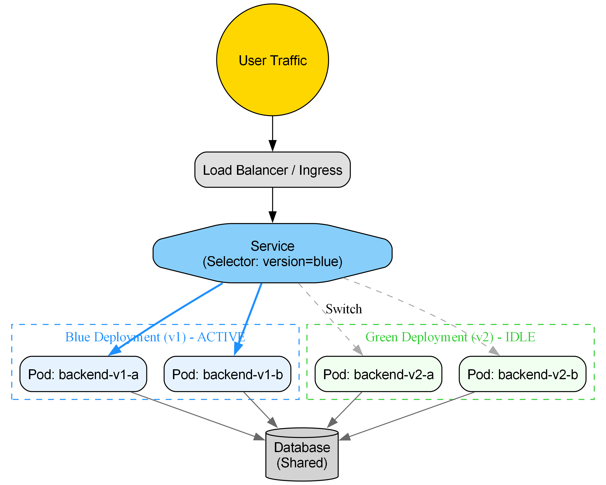
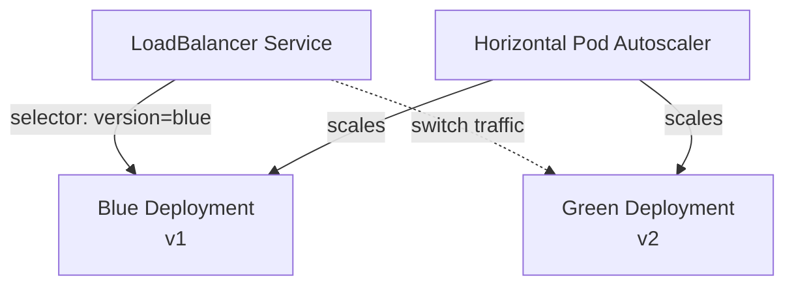

# Blue-Green Deployment PoC


> **Note**: This project is a **Proof of Concept (PoC)** designed for educational and demonstration purposes.

A proof-of-concept demonstrating **Blue-Green deployment** strategy using Kubernetes with a Node.js/TypeScript backend application.

## Overview

This project showcases zero-downtime deployments by maintaining two identical production environments (Blue and Green). Traffic can be instantly switched between versions, enabling safe deployments with quick rollback capabilities.

## Showcase



**Short Description:**
> A robust, zero-downtime Blue-Green deployment system for Kubernetes, featuring automated health checks, instant rollbacks, and seamless traffic switching.

### Key Features

- **Zero-downtime deployments**: Switch traffic between versions instantly
- **Quick rollback**: Revert to the previous version in seconds
- **Health monitoring**: Automated readiness and liveness probes
- **Auto-scaling**: Horizontal Pod Autoscaler (HPA) for dynamic scaling
- **Containerized**: Docker-based application packaging
- **Production-ready**: Multi-stage builds, resource limits, and health checks

## Architecture



## Quick Start

> [!IMPORTANT] > **New to this project?** Start with the complete setup guide: [SETUP.md](SETUP.md)
>
> This guide walks you through setting up everything from a vanilla Ubuntu server.

### Prerequisites

- Docker (v20.10+)
- Minikube (v1.30+)
- minikube kubectl -- (installed with minikube)
- Node.js 18+ (for local development)

### Installation

1. **Clone the repository**

   ```bash
   git clone <repository-url>
   cd kurbentes
   ```

2. **Install dependencies**

   ```bash
   npm install
   ```

3. **Build the application**

   ```bash
   npm run build
   ```

4. **Build Docker images**

   ```bash
   # Build version 1 (Blue)
   docker build -t backend:v1 --build-arg APP_VERSION=v1 .

   # Build version 2 (Green)
   docker build -t backend:v2 --build-arg APP_VERSION=v2 .

   # Load images into minikube
   minikube image load backend:v1
   minikube image load backend:v2
   ```

5. **Deploy to Kubernetes**

   ```bash
   # Deploy service
   minikube kubectl -- apply -f k8s/service.yaml

   # Deploy blue version
   minikube kubectl -- apply -f k8s/blue-deployment.yaml

   # Deploy green version
   minikube kubectl -- apply -f k8s/green-deployment.yaml

   # Apply HPA
   minikube kubectl -- apply -f k8s/hpa.yaml
   ```

## Usage

### Deploying a New Version

Use the deployment script to switch between blue and green versions:

```bash
# Deploy and switch to blue version
./deploy.sh blue

# Deploy and switch to green version
./deploy.sh green
```

The script performs the following steps:

1. Deploys the target version
2. Waits for pods to be ready
3. Runs validation checks
4. Switches traffic to the new version

### Testing the Application

```bash
# Get the service URL (minikube will open in browser)
minikube service backend-service --url

# Or use in terminal
SERVICE_URL=$(minikube service backend-service --url)
curl $SERVICE_URL/
# Response: "Hello from Backend v1!" or "Hello from Backend v2!"

# Check version
curl $SERVICE_URL/version

# Health check
curl $SERVICE_URL/health
```

### Monitoring

```bash
# View pods
minikube kubectl -- get pods -l app=backend

# View deployments
minikube kubectl -- get deployments

# View service details
minikube kubectl -- get service backend-service

# Check HPA status
minikube kubectl -- get hpa backend-hpa

# View logs
minikube kubectl -- logs -l app=backend --tail=50
```

## Project Structure

```
kurbentes/
├── src/
│   └── server.ts           # Express application
├── k8s/
│   ├── blue-deployment.yaml   # Blue version deployment
│   ├── green-deployment.yaml  # Green version deployment
│   ├── service.yaml          # LoadBalancer service
│   └── hpa.yaml              # Horizontal Pod Autoscaler
├── docs/                    # Additional documentation
├── Dockerfile              # Multi-stage Docker build
├── deploy.sh              # Blue-Green deployment script
├── package.json
├── tsconfig.json
└── README.md
```

## API Endpoints

| Endpoint   | Method | Description                                |
| ---------- | ------ | ------------------------------------------ |
| `/`        | GET    | Returns greeting with version              |
| `/version` | GET    | Returns version information                |
| `/health`  | GET    | Health check endpoint (readiness/liveness) |

## Development

### Local Development

```bash
# Run in development mode with auto-reload
npm run dev

# Build TypeScript
npm run build

# Run production build
npm start
```

### Making Code Changes

1. Update code in `src/server.ts`
2. Update `APP_VERSION` environment variable in deployment files
3. Build new Docker image with new version tag
4. Deploy using `deploy.sh`

## Configuration

### Environment Variables

- `PORT`: Server port (default: 3000)
- `APP_VERSION`: Application version identifier

### Resource Limits

Each pod has the following resource configuration:

- **Requests**: 100m CPU, 128Mi memory
- **Limits**: 200m CPU, 256Mi memory

### Auto-scaling

HPA configuration:

- **Min replicas**: 2
- **Max replicas**: 10
- **CPU target**: 50% utilization

## Troubleshooting

### Pods not starting

```bash
# Check pod status
minikube kubectl -- describe pod <pod-name>

# View logs
minikube kubectl -- logs <pod-name>
```

### Service not accessible

```bash
# Verify service exists
minikube kubectl -- get service backend-service

# Check endpoints
minikube kubectl -- get endpoints backend-service

# Use minikube service to access
minikube service backend-service

# Or get URL
minikube service backend-service --url
```

### Traffic not switching

```bash
# Verify service selector
minikube kubectl -- get service backend-service -o yaml | grep -A 2 selector

# Manually patch service
minikube kubectl -- patch service backend-service -p '{"spec":{"selector":{"version":"blue"}}}'
```

### HPA not scaling

```bash
# Check metrics server is running
minikube kubectl -- get deployment metrics-server -n kube-system

# View HPA details
minikube kubectl -- describe hpa backend-hpa
```

## Advanced Topics

### Rollback Strategy

If issues are detected after deployment:

```bash
# Quick rollback - switch service selector back
minikube kubectl -- patch service backend-service -p '{"spec":{"selector":{"version":"blue"}}}'
```

### Canary Deployment

Modify service to split traffic:

```bash
# Create separate services for blue/green
# Use an Ingress controller with traffic splitting
```

### Database Migrations

> [!WARNING]
> For database schema changes, ensure backward compatibility during blue-green deployments.

Best practices:

1. Make schema changes backward compatible
2. Deploy new version alongside old version
3. Run migrations before traffic switch
4. Keep old version running until migrations are verified

## Documentation

- **[SETUP.md](SETUP.md)**: Complete setup guide from vanilla Ubuntu server
- **[DEPLOYMENT.md](DEPLOYMENT.md)**: Detailed deployment strategies and procedures
- **[docs/](docs/)**: Additional technical documentation

## Contributing

1. Fork the repository
2. Create a feature branch
3. Make your changes
4. Test thoroughly
5. Submit a pull request

## License

MIT License - see LICENSE file for details

## Support

For issues or questions:

- Check the [Troubleshooting](#troubleshooting) section
- Review [SETUP.md](SETUP.md) for configuration issues
- Open an issue in the repository

---

**Happy Deploying!**
